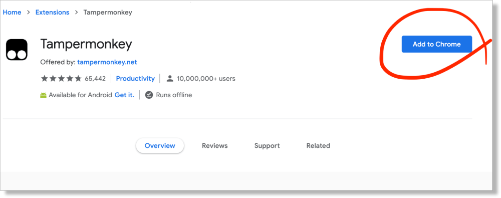
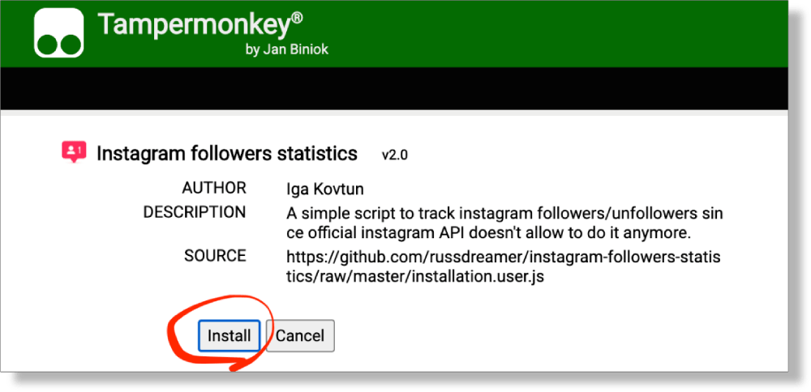
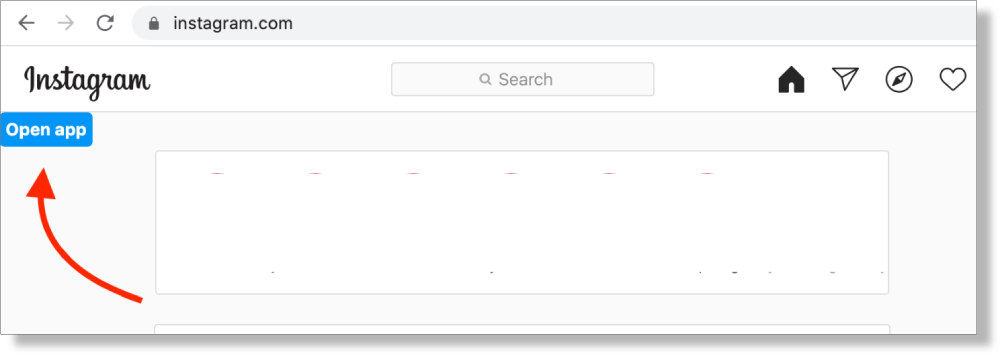
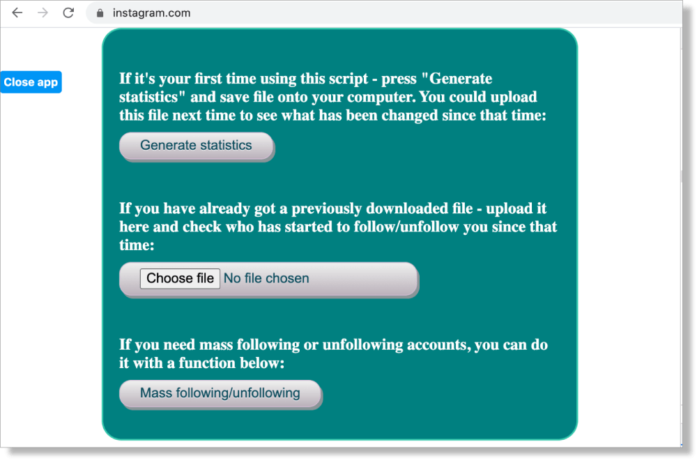

# How to figure out who unfollowed you on Instagram?

A simple script to track instagram followers/unfollowers since official instagram API doesn't allow to do it anymore. It also allows to follow/unfollow users automaticly with set configurations.   

## How to install:
There are 4 simple steps:  	
 
1. Install **Tampermonkey** browser's extension for <a target="_blank" href="https://chrome.google.com/webstore/detail/tampermonkey/dhdgffkkebhmkfjojejmpbldmpobfkfo">Chrome</a>, 
<a target="_blank" href="https://microsoftedge.microsoft.com/addons/detail/tampermonkey/iikmkjmpaadaobahmlepeloendndfphd">Microsoft Edge</a>, 
<a target="_blank" href="https://apps.apple.com/us/app/tampermonkey/id1482490089">Safari</a>, 
<a target="_blank" href="https://addons.opera.com/en/extensions/details/tampermonkey-beta/">Opera</a> or 
<a target="_blank" href="https://addons.mozilla.org/en-US/firefox/addon/tampermonkey/">Firefox</a>. All browser's versions you can find <a href="http://www.tampermonkey.net/" target="_blank">here</a>. 

2. Install <a tagret="_blank" href="https://github.com/russdreamer/instagram-followers-statistics/raw/master/installation.user.js">Instagram script</a>.  

3. Log in into your <a target="_blank" href="https://www.instagram.com/">Instagram.</a>
4. Click «Open app» and enjoy the application! 🙂 
 

## How to use:  
 

## Following statistics over time:
Since version 3.0. you are able to track also who you started to follow and unfollow. In conjunction with [Hidden functionality](https://github.com/russdreamer/instagram-followers-statistics#hidden-functionality-) you can track also who other users started following/unfollowing.

## Hidden functionality:  
If you'd like to track another user's followers and its user page is open to you, you're able to do that! Just press Alt+V (Option+V on Mac) and you'll see an additional field for the username. Type its username and perform the same tracking actions as you did with your own account 🥳

## Metrics collection:
Why this application is free and no donates are available? Because I've created it for myself first and feel happy if my brainchild helps to others. 
Since version 3.0. the only metric that the application gathers is how often users use this application. It doesn't gather any personalized data and even what kind of action you performed. This metrics helps me to know that you still find my app usefull and makes me to stay motivated to develope additional functionality in the future. 

## Donation:
The best donation is the knowledge that my application benefits someone. I'll be grateful if you just tell your friends about my application 🙂
